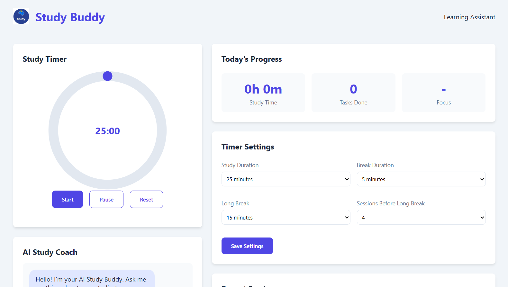
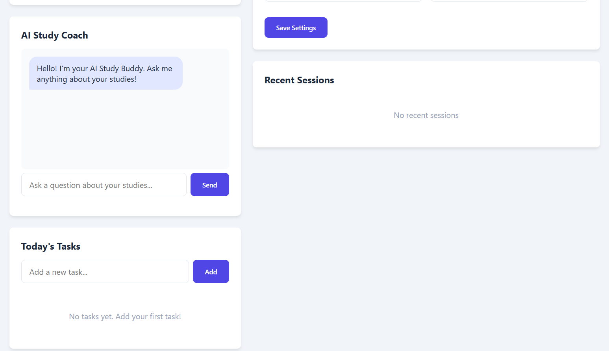

# 📚 StudyBuddy – Smart Study & Productivity Dashboard

StudyBuddy is a modern web application designed to help students stay productive through focused study sessions, task management, progress tracking, and an AI-inspired study coach interface.

Built using **HTML, CSS, and JavaScript**, the application combines a Pomodoro timer with productivity tools to create an all-in-one study companion.

---

## 🌐 Live Demo

🔗 https://soumyafernandez.github.io/StudyBuddy/

> *(Update this link if your repository name is different.)*

---

# 📸 Project Preview



---

# 🖼️ Additional Screenshots

### 🤖 AI Study Coach & Task Manager



---

# ✨ Features

- ⏳ Pomodoro Study Timer
- 📈 Daily Study Progress Dashboard
- ✅ Task Management
- 🤖 AI Study Coach Interface
- ⚙️ Customizable Study & Break Duration
- 📚 Recent Study Session Tracking
- 💾 Local Storage Support
- 📱 Responsive User Interface

---

# 🛠️ Tech Stack

- HTML5
- CSS3
- JavaScript (Vanilla)
- Local Storage

---

# 📂 Project Structure

```text
StudyBuddy/
│
├── index.html
├── style.css
├── script.js
├── screenshots/
│   ├── dashboard.png
│   └── features.png
└── README.md
```

---

# 🚀 How It Works

1. Start a focused study session using the Pomodoro timer.
2. Customize study and break durations.
3. Track your daily study time and completed tasks.
4. Add and manage your study tasks.
5. Interact with the AI Study Coach interface.
6. Review recent study sessions and monitor your productivity.

---

# 💡 Key Components

### ⏳ Pomodoro Timer

A customizable study timer that helps maintain focus through structured work and break sessions.

---

### 📈 Progress Dashboard

Displays:

- Total Study Time
- Tasks Completed
- Focus Status

---

### 🤖 AI Study Coach

A simple chatbot-style interface designed to simulate a virtual study assistant for motivation and guidance.

---

### ✅ Task Manager

Allows users to:

- Add study tasks
- Organize daily work
- Track completion

---

### 📚 Session Tracking

Records recent study sessions, helping users review their productivity over time.

---

# 🎯 Learning Outcomes

This project helped me practice:

- DOM Manipulation
- Event Handling
- JavaScript Timers
- Local Storage
- Responsive Web Design
- Frontend UI Development
- State Management using JavaScript

---

# 🚀 Future Improvements

- User Authentication
- Firebase Backend
- AI-powered Study Recommendations
- Calendar Integration
- Subject-wise Analytics
- Study Streak Tracking
- Dark Mode
- Cloud Data Synchronization
- Study Groups & Collaboration

---

# 💻 Installation

Clone the repository:

```bash
git clone https://github.com/soumyafernandez/StudyBuddy.git
```

Navigate into the project:

```bash
cd StudyBuddy
```

Open `index.html` in your browser.

No additional dependencies are required.

---

# 👨‍💻 Author

**Soumya Fernandez**

- GitHub: https://github.com/soumyafernandez

---

## ⭐ If you found this project helpful, consider giving it a Star!
